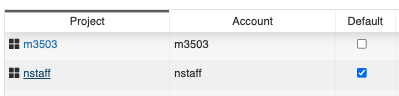
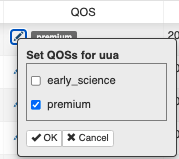

# Troubleshooting Slurm

??? "How do I find which Slurm accounts I am part of?"    
     
    You can use the `iris` command line interface to [iris](https://iris.nersc.gov/) to retrieve user details. 
    The first column **Project** is all the Slurm accounts a user is associated with.  
   
    In this example, the current user is part of two accounts `nstaff` and `m3503`.  
    
    ```console
    $ iris
    Project      Used(user)    Allocated(user)        Used    Allocated
    ---------  ------------  -----------------  ----------  -----------
    m3503               0.0          1000000.0     12726.1    1000000.0
    nstaff          21690.5          4000000.0  26397725.1   80000000.0
    ```        

??? "What is my default Slurm account?"
    
    You can find the default user account by logging into https://iris.nersc.gov and navigate to  **CPU** tab, 
    you will see a column `Default` that shows your default Slurm account. In this example, the user
    default account is `nstaff` which means that user job will be charged to `nstaff` account even if they do
    not specify `#SBATCH -A` in their job script.
    
    
     
??? "My job will terminate because it will exceed queue run time limit, what can I do?"
    
    If your job terminates due to queue run limit, you have a few options: 
    
    1. Optimize your workflow by profiling your code. We have several profiling tools including **HPCToolkit**, 
       **CrayPAT**, **MAP**, **Intel VTune**, **Parallelware Trainer**.  For more details on profilers see 
       [performance tools](../tools/performance/index.md) page
    2. Increase Node/Processor count to reduce runtime. 
    3. Utilize checkpoint/restart via [DMTCP](../development/checkpoint-restart/dmtcp/index.md)
    4. If all else fails, request a  [reservation](reservations.md)  
        
??? "What is a Slurm multi-cluster mode?"
    
     At Cori, we have configured Slurm in [Multi-Cluster](https://slurm.schedmd.com/multi_cluster.html)
    mode with two clusters `cori` and `escori`. Each Slurm cluster is independent,  with its own 
    Slurm environment (partitions/qos) and job accounting.
    
    When you login to Cori, your default cluster is `cori`, and you can run jobs to Slurm cluster
    via `sbatch --clusters=cori` or `sbatch --clusters=escori`. 
        
    In order to submit jobs to `escori` Slurm cluster you need to load the
    following module:
    
    ```
    module load esslurm
    ```
    
    !!! note
        `module load esslurm` will make `escori` your default Slurm
        cluster. If you want to revert back to `cori` unload the module
        (`module unload esslurm`).
    
    The default Slurm binaries are in `/usr/bin` but we place
    Slurm binaries for esslurm (i.e., `sbatch`, `squeue`, `sacct`, `srun`) in
    `/opt/esslurm/bin`. Once you load the module *your* `sbatch` should be the
    following:
    
    ```
    cori$ which sbatch
    /opt/esslurm/bin/sbatch
    ```

??? "How do I monitor a job that I submitted?"  

    If you want to monitor your jobs please use `squeue`, or `sacct` and see [monitoring](monitoring.md) page
    for more details. Please note that the jobID's are unique to the Slurm cluster (`cori`, `escori`), for instance if 
    you submit a job to `xfer` queue your job will be routed to the `escori` Slurm cluster and you will need to 
    use `squeue --clusters=escori` or `sacct --clusters=escori` to monitor the job. 
                
??? "Unable to submit jobs to premium queue?"

    You need to login to https://iris.nersc.gov and confirm your account has access to `premium` queue. If you are a PI
    please see [Enabling the premium QOS](../iris/iris-for-pis/#enabling-the-premium-qos-available-from-ay21) and
    grant your colleague access to `premium` queue. If you are not a PI, please contact your PI to add your 
    username to queue. This change will take up to an hour to propagate to our systems. 
    
    Shown below is a snapshot from iris to enable premium queue access. Please note this is granted **per project** 
    (`#SBATCH -A <account>`).
    
     
    
??? "Why is my job marked as `InvalidQOS`?"

    This indicates you have specified incorrect qos name `#SBATCH -q <QOS>` in your job-script. Please
    check our [queue policy](policy.md) for list of available queues and correct
    your job script.
    
    If your account incurs a negative balance, your project will be restricted to **overrun** and **xfer** queue. 
    Take for example, project `m0001` has a negative balance since it used 75,000 node hours whereas the
    project limit was 50,000. We can check this using `iris` command.
    
    ```console
    cori$ iris 
    Project      Used(user)    Allocated(user)       Used    Allocated
    ---------  ------------  -----------------  ---------  -----------
    m0001***      750000.0          50000.0     750000.0    50000.0
    *   = user share of project Negative
    **  = project balance negative
    *** = user and project balance negative
    ```
    
    Due to this change, project `m0001` will be restricted to subset of queues, if you have previously run jobs 
    on default queues (`debug`, `flex`, `regular`), your jobs will be stuck indefinitely and you should consider killing
    the jobs using [scancel](monitoring.md#cancel-jobs). 
    
## Cannot Submit Jobs

If you are unable to submit jobs we recommend you check the following

- Check your job script for error (invalid qos name, missing time-limit, invalid node count or cpu count, etc...)
- Check the [MOTD](https://www.nersc.gov/live-status/motd/) and see if Cori is online. See https://my.nersc.gov/
- Check [NERSC outage calendar](https://my.nersc.gov/outagecal-cs.php) for scheduled outage
- Check [Queue Policy](policy.md) to ensure your job complies with Slurm policies  
- Check if you have `esslurm` module loaded, this exposes different Slurm binaries. Unloading this module will solve many of 
  your errors.
    - If you are submitting jobs to `xfer`, `compile`, `bigmem` queue, check that you have `esslurm` module loaded  
    - For any other cori jobs, ensure that the `esslurm` module is not loaded
- **If you are having issues with Cori GPU jobs then please see 
  [Cori GPU Documentation](https://docs-dev.nersc.gov/cgpu/access/)**.    
- Check your startup configuration files `~/.bashrc` and `~/.bashrc.ext` for any user environment `PATH`, `LD_LIBRARY_PATH`, 
  modules, or aliases that may impact your shell.  
- Check if you are charging to correct account (`-A <Account>`). If you are not sure of your project code you can run `iris` or 
  login to https://iris.nersc.gov/
- Check if you have negative balance for your project, if so please contact your project PI. You can run 
  `iris` to see your project details.
- Check your file system quota using `myquota`, if your account exceeds quota limit you won't be able to submit jobs

If all else fails please submit a ticket at http://help.nersc.gov/ with the following details:

 - Job Script and/or Slurm command
 - Output of `module list`
 - Output of warning/error messages 
 - Time when command was run (use `date` command)
 - Add any attachments necessary to troubleshoot issue 

## Common Errors With Jobs

Some common errors encountered during submit or run times
and their possible causes are shown in the following table.

### Job submission errors

-   Error message:

    ```
    sbatch: error: Your account has exceeded a file system quota and is not permitted to submit batch jobs.  Please run `myquota` for more information.
    ```

    Possible causes/remedies:

    Your file system usage is over the quota(s). Please run the
    `myquota` command to see which quota is exceeded. Reduce usage
    and resubmit the job.

-   Error message:

    ```
    sbatch: error: Job request does not match any supported policy.
    sbatch: error: Batch job submission failed: Unspecified error.
    ```

    Possible causes/remedies:

    There is something wrong with your job submission parameters
    and the request (the requested number of nodes, the walltime
    limit, etc.) does not match the policy for the selected qos.
    Please check the [queue policy](policy.md).

    This error also happens when the job submission didn't include
    the `--time-min` line with the `flex`.

-   Error message:

    ```
    sbatch: error: More resources requested than allowed for logical queue shared (XX requested core-equivalents > YY)
    sbatch: error: Batch job submission failed: Unspecified error
    ```

    Possible causes/remedies:

    The number of logical cores that your job tries to use exceeds
    the the number that you requested for this `shared` qos job.

-   Error message:

    ```
    Job submit/allocate failed: Unspecified
    ```

    Possible causes/remedies:

    This error could happen if a user has no active NERSC project on
    Cori.  Please make sure your NERSC account is renewed with an
    active allocation.

-   Error message:

    ```
    Job submit/allocate failed: Invalid qos specification
    ```

    Possible causes/remedies:

    This error mostly happens if a user has no access to certain
    Slurm qos.  For example, a user who doesn't have access to the
    `realtime` qos would see this error when submitting a job to
    the qos.

-   Error message:

    ```
    sbatch: error: Batch job submission failed: Socket timed out on send/recv operation
    ```

    Possible causes/remedies:

    The job scheduler is busy. Some users may be submitting lots
    of jobs in a short time span. Please wait a little bit before
    you resubmit your job.

    This error normally happens when submitting a job, but can
    happen during runtime, too.

-   Error message:

    ```
    cori$ salloc ... --qos=interactive
    salloc: Pending job allocation XXXXXXXX
    salloc: job XXXXXXXX queued and waiting for resources
    salloc: error: Unable to allocate resources: Connection timed out
    ```

    Possible causes/remedies:

    The interactive job could not start within 6 minutes, and,
    therefore, was cancelled. It is because either the number of
    available nodes left from all the reserved interactive nodes or
    out of the 64 node limit per NERSC project was less than what you
    requested. See our [Cori "interactive" QOS](interactive.md) policy page for more
    details.

-   Error message:

    ```
    sbatch: error: No architecture specified, cannot estimate job costs.
    sbatch: error: Batch job submission failed: Unspecified error
    ```

    Possible causes/remedies:

    Your job didn't specify the type of compute nodes. To run on
    Haswell nodes, add to your batch script:

    ```
    #SBATCH -C haswell
    ```

    To request KNL nodes, add this line:

    ```
    #SBATCH -C knl
    ```

-   Error message:

    ```
    sbatch: error: The overrun logical queue requires an lower balance than the estimated job cost. Job cost estimated at XX.XX NERSC-Hours, your balance is YYYYYY.YY NERSC-Hours (Repo: YYYYYYY.YY NERSC-Hours). Cannot proceed, please see https://docs.nersc.gov/jobs/policy/ for your options to run this job.
    sbatch: error: Batch job submission failed: Unspecified error
    ```

    Possible causes/remedies:

    You submitted the job to the `overrun` partition directly.  When
    you submit a job with a normal qos (e.g., `regular`, `debug`,
    etc.), requesting more NERSC-Hours than your NERSC project
    balance, it will be automatically routed to the `overrun` queue.

-   Error message:

    ```
    sbatch: error: No available NERSC-hour balance information for user xxxxx, account yyyyy. Cannot proceed.
    sbatch: error: Batch job submission failed: Unspecified error
    ```

    Possible causes/remedies:

    You submitted the job using a project that you are not allowed to
    use.  Login in to [Iris](https://iris.nersc.gov) to see which
    NERSC project you can use.

-   Error message:

    ```
    sbatch: error: Batch job submission failed: Unable to contact Slurm controller (connect failure)
    ```

    Possible causes/remedies:

    There may be an issue with Slurm. If the error is still seen after
    a few minutes, report to NERSC.

-   Error message:

    ```
    sbatch: error: Job cost estimated at XXXXXXXX.XX NERSC-Hours, your balance is XXXXXXX.XX NERSC-Hours (Repo: XXXXXXXX.XX NERSC-Hours). Cannot proceed, please see https://docs.nersc.gov/jobs/policy/ for your options to run this job.
    sbatch: error: Job submit/allocate failed: Unspecified error
    ```

    Possible causes/remedies:

    Your remaining NERSC project balance is not big enough to run the
    job.

-   Error message:

    ```
    srun: error: Unable to create step for job XXXXXXXX: More processors requested than permitted
    ```

    Possible causes/remedies:

    Your `srun` command required more logical cores than available.
    Please check the values for the `-n`, `-c`, etc.

### Runtime errors

-   Error message:

    ```
    srun: error: eio_handle_mainloop: Abandoning IO 60 secs after job shutdown initiated.
    ```

    Possible causes/remedies:

    Slurm is giving up waiting for stdout/stderr to finish. This
    typically happens when some rank ends early while others are
    still wanting to write. If you don't get complete stdout/stderr
    from the job, please resubmit the job.

-   Error message:

    ```
    Tue Jul 17 18:04:24 2018: [PE_3025]:_pmi_mmap_tmp: Warning bootstrap barrier failed: num_syncd=3, pes_this_node=68, timeout=180 secs
    ```

    Possible causes/remedies:

    Use the `sbcast` command to transmit the executable to all
    compute nodes before a srun command. For more information
    on `sbcast`, click [here](best-practices.md#large-jobs).

-   Error message:

    ```
    slurmstepd: error: _send_launch_resp: Failed to send RESPONSE_LAUNCH_TASKS: Resource temporarily unavailable
    ```

    Possible causes/remedies:

    This situation does not affect the job. This issue may have been fixed.

[comment]: <> (-   Error message:)
[comment]: <> ()
[comment]: <> (    ```)
[comment]: <> (    libgomp: Thread creation failed: Resource temporarily unavailable)
[comment]: <> (    ```)
[comment]: <> ()
[comment]: <> (    Possible causes/remedies:)
[comment]: <> ()

-   Error message:

    ```
    srun: fatal: Can not execute vasp_gam
    /var/spool/slurmd/job15816716/slurm_script: line 17: 34559
    Aborted                 srun -n 32 -c8 --cpu-bind=cores vasp_gam
    ```

    Possible causes/remedies:

    The user does not belong to a VASP group. The user needs
    to provide VASP license info following the instructions in
    [here](../applications/vasp/index.md#access).

-   Error message:

    ```
    cori$ sqs
    JOBID     ST  ...  REASON
    XXXXXXXX  PD  ...  Nodes required*
    ...
    ```

    or

    ```
    cori$ scontrol show job XXXXXXXX
    ...
    JobState=PENDING Reason=Nodes_required_for_job_are_DOWN,_DRAINED_or_reserved_for_jobs_in_higher_priority_partitions Dependency=(null)
    ...
    ```

    Possible causes/remedies:

    The job was tentatively scheduled to start as a backfill job.
    But some of the assigned nodes are now down, drained or re-assigned
    to a higher priority job. Wait until Slurm reschedules the job.

-   Error message:

    ```
    srun: Job XXXXXXXX step creation temporarily disabled, retrying
    ```

    Possible causes/remedies:

    This often happens when there are many `srun` commands in a
    batch job and compute nodes are not fully completed from the
    last `srun` before the next one starts. Usually the next job
    step starts eventually.

    However, if you observe a significant delay with starting a
    `srun` command, the problem may have to be examined by NERSC
    staff.  In that case, please report the problem to us. Length
    of the delay, however, can depend on resources (memory, threads,
    I/O, etc.) involved in the last job step.

-   Error message:

    ```
    srun: error: Unable to create step for job XXXXXXXX: Job/step already completing or completed
    ```

    which appears with or without this message:

    ```
    srun: Job XXXXXXXX step creation temporarily disabled, retrying
    ```

    Possible causes/remedies:

    This may be caused by a system issue. Please report to NERSC.

-   Error message:

    ```
    Tue Sep 18 20:13:26 2018: [PE_5]:inet_listen_socket_setup:inet_setup_listen_socket: bind failed port 63725 listen_sock = 4 Address already in use
    Tue Sep 18 20:13:26 2018: [PE_5]:_pmi_inet_listen_socket_setup:socket setup failed
    Tue Sep 18 20:13:26 2018: [PE_5]:_pmi_init:_pmi_inet_listen_socket_setup (full) returned -1
    ...
    ```

    Possible causes/remedies:

    Typically this error indicates that multiple applications have
    been launched on the same node, and both are using the same PMI
    (Process Management Interface, which supports launching and
    managing the processes that make up the execution of a parallel
    program; see the `intro_pmi` man page for more info) control
    port number. When running multiple applications per node, it
    is the launcher's responsibility to provide PMI with a new
    (available) port nuber by setting the `PMI_CONTROL_PORT` env
    variable. Slurm typically does this.

    You can try either of the following approaches to suppress the
    PMI errors because your code runs on a single node and does not
    communicate between nodes:

    -   Recompile your code with the `craype-network-aries` module
	unloaded, then the PMI library will not be linked into your
	code:

        ```shell
        cori$ module swap craype-network-aries craype-network-none
        ```

    -   Set the fowllowing two env variables:

        ```shell
        cori$ export PMI_NO_FORK=1
        cori$ export PMI_NO_PREINITIALIZE=1
        ```

-   Error message:

    ```
    /some/path/ ./a.out error while loading shared libraries: /opt/gcc/7.3.0/snos/lib64/libgomp.so.1: cannot read file data:
    Input/output error
    ...
    ```

    Possible causes/remedies:

    A possible cause is that the `LD_LIBRARY_PATH` environment
    varialbe has been modified.  Since `libgomp.so.1` is part of
    the Intel libraries, you can try unloading the `gcc` module
    with `module unload gcc` if it is loaded, or reloading the
    `intel` module with `module load intel`.

[comment]: <> (-   Error message:)
[comment]: <> ()
[comment]: <> (    ```)
[comment]: <> (    sacct: error: slurm_persist_conn_open: failed to send persistent connection init message to corique01:6819)
[comment]: <> (    sacct: error: slurmdbd: Getting response to message type 1444)
[comment]: <> (    sacct: error: slurmdbd: DBD_GET_JOBS_COND failure: Unspecified error)
[comment]: <> (    ```)
[comment]: <> ()
[comment]: <> (    or)
[comment]: <> ()
[comment]: <> (    ```)
[comment]: <> (    sacct: error: slurm_persist_conn_open_without_init: failed to open persistent connection to corique01:6819: Connection refused)
[comment]: <> (    ```)
[comment]: <> ()
[comment]: <> (    Possible causes/remedies:)
[comment]: <> ()

-   Error message:

    ```
    slurmstepd: error: Detected zonesort setup failure: Could not open job cpuset (########.#)
    ```

    Possible causes/remedies:

    KNL's MCDRAM cache is prone to cache thrashing because it uses
    direct mapped caching, which can result in slow code performance.
    To alleviate this possibility, the system's Node Health Check
    tool runs the 'zonesort' kernel module on compute nodes. For
    more info, please see [KNL Cache
    Mode](../performance/knl/cache-mode.md). Note that the zonesort
    module is also run on Haswell nodes although performance
    implication may not be as significant since direct mapped caching
    is not used.

    The error message means that running the zonesort kernel failed
    for some reason. The end result is that your code may have run
    less optimally. Other than that, the message is usually harmless.
    If your job failed because the application ran slowly, please
    resubmit the job.

-   Error message:

    ```
    slurmstepd: error: _is_a_lwp: open() /proc/XXXXX/status failed: No such file or directory
    ```

    Possible causes/remedies:

    `_is_a_lwp` is a function called internally for Slurm job
    accounting.  The message indicates a rare error situation with
    a function call. But the error shouldn't affect anything in the
    user job. Please ignore the message.

-   Error message:

    ```
    Unable to open file (unable to lock file, errno = 524, error message = 'Unknown error 524')
    ```

    Possible causes/remedies:

    You are running a program built against the Cray versions of HDF5
    or NetCDF on a NGF file system (CFS, HOME, etc).
    A fix is available in the following pages:

    * [HDF5 library](../../development/libraries/hdf5/)
    * [NetCDF library](../../development/libraries/netcdf/)

-   Error message when copying files to Burst Buffer:

    ```
    cp: error writing '/var/opt/cray/dws/mounts/batch/YourPersistentReservation/a_file': Read-only file system
    ```

    or in a Python program:
    
    ```
    Traceback (most recent call last):
    ...
    OSError: [Errno 30] Read-only file system
    ```

    Too many writes have been performed in your Burst Buffer
    allocation, which triggered the write protection of the
    underlying SSDs and made the file system read-only, to avoid
    drive blocks to wear out too quickly.

    If you are using a Burst Buffer allocation and need to
    access the same files from multiple jobs, consider using a
    Persistent Reservation (PR): no backup is performed of data on
    Burst Buffer, so always stage-out/copy the important files.
    See the related page on
    [Burst Buffer](../filesystems/cori-burst-buffer.md).

    The solution is to either wait some hours for the SSDs to
    "cooldown", or request a new and bigger PR (remember that
    resources are limited and other users may also need storage
    space).    
    