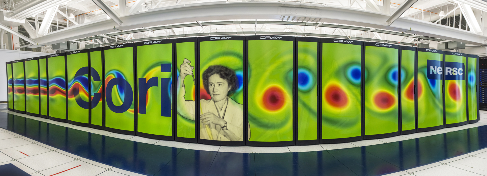

# Cori

Cori is a Cray XC40 with a peak performance of about 30 petaflops.
The system is named in honor of American
biochemist [Gerty Cori](https://en.wikipedia.org/wiki/Gerty_Cori), the
first American woman to win a Nobel Prize and the first woman to be
awarded the prize in Physiology or Medicine. Cori is comprised of
2,388 Intel Xeon "Haswell" processor nodes, 9,688 Intel Xeon Phi
"Knight's Landing" (KNL) nodes. The system also has a large Lustre
scratch file system and a first-of-its kind NVRAM "burst buffer"
storage device.

## Usage

* [Accounts](../../accounts/index.md)
* [Getting Started](../../getting-started.md)
* Connecting: ([SSH](../../connect/index.md#ssh)) ([MFA](../../connect/mfa.md))
* [Example jobs](../../jobs/examples/index.md)
* [Precompiled Applications](../../applications/index.md)
* [Queue Policies](../../jobs/policy.md)

## System Overview

| System Partition | # of cabinets | # of nodes | Aggregate Theoretical Peak | Aggregate Memory |
|------------------|---------------|------------|----------------------------|------------------|
| Login            | -             | 20         | -                          | -                |
| Haswell          | 14            | 2,388      | 2.81 PFlops                | 298.5 TB         |
| KNL              | 54            | 9,688      | 29.5 PFlops                | 1.09 PB          |
| Large Memory     | -             | 20         | 30.7 TFlops                | 40 TB            |

### File Systems

* [Cori scratch](../../filesystems/cori-scratch.md)
* [Burst Buffer](../../filesystems/cori-burst-buffer.md)
* [File systems at NERSC](../../filesystems/index.md)

## System Specification

| System Partition | Processor                         | Clock Rate | Physical  Cores Per Node | Threads/Core | Sockets Per Node | Memory Per Node               |
|------------------|-----------------------------------|------------|--------------------------|--------------|------------------|-------------------------------|
| Login            | [Intel Xeon Processor E5-2698 v3] | 2.3 GHz    | 32                       | 2            | 2                | 515 GB                        |
| Haswell          | [Intel Xeon Processor E5-2698 v3] | 2.3 GHz    | 32                       | 2            | 2                | 128 GB                        |
| KNL              | [Intel Xeon Phi Processor 7250]   | 1.4 GHz    | 68                       | 4            | 1                | 96 GB (DDR4), 16 GB (MCDRAM) |
| Large Memory     | [AMD EPYC 7302]                   | 3.0 GHz    | 32                       | 2            | 2                | 2 TB                          |

Each XC40 cabinet housing Haswell and KNL nodes has 3 chassis; each
chassis has 16 compute blades with 4 nodes per blade. Login nodes
and the Large Memory Nodes are in separate cabinets.

[Intel Xeon Processor E5-2698 v3]: https://ark.intel.com/products/81060/Intel-Xeon-Processor-E5-2698-v3-40M-Cache-2_30-GHz
[Intel Xeon Phi Processor 7250]: http://ark.intel.com/products/94035/Intel-Xeon-Phi-Processor-7250-16GB-1_40-GHz-68-core
[AMD EPYC 7302]: https://www.amd.com/en/products/cpu/amd-epyc-7302

### Interconnect

Cray Aries with Dragonfly topology with >45 TB/s global peak bisection
bandwidth.

[Details about the interconnect](interconnect/index.md)

## Node Specifications

### Login Nodes

* Cori has 12 Login nodes (`cori[01-12]`) open to public.
* 2 Large Memory Login nodes (`cori[22,23]`) to submit to `bigmem` qos. These nodes have 750GB of memory.
* 4 Jupyter nodes (`cori[13,14,16,19]`]) access via Jupyter
* 2 Workflow nodes (`cori[20,21]`) - requires approval before access to node
* 1 Compile node (`cori17`) - requires approval before access to node
* Each node has two sockets, each socket is populated with a 2.3 GHz 16-core Haswell processor.

For more details on connecting to login nodes click [here](../../connect/index.md). 
    
### Haswell Compute Nodes

* Each node has two sockets, each socket is populated with a
  2.3 GHz 16-core Haswell processor.
  [Intel Xeon Processor E5-2698 v3](https://ark.intel.com/products/81060/Intel-Xeon-Processor-E5-2698-v3-40M-Cache-2_30-GHz).
* Each core supports 2 hyper-threads, and has two 256-bit-wide vector
  units
* 36.8 Gflops/core (theoretical peak)
* 1.2 TFlops/node (theoretical peak)
* 2.81 PFlops total (theoretical peak)
* Each node has 128 GB DDR4 2133 MHz memory (four 16 GB DIMMs per
  socket)
* 298.5 TB total aggregate memory

[Haswell CPU topology](images/haswell_node.png)

### KNL Compute Nodes

* Each node is a single-socket [Intel Xeon Phi Processor
  7250](http://ark.intel.com/products/94035/Intel-Xeon-Phi-Processor-7250-16GB-1_40-GHz-68-core)
  ("Knights Landing") processor with 68 cores @ 1.4 GHz
* Each core has two 512-bit-wide vector processing units
* Each core has 4 hardware threads (272 threads total)
* AVX-512 vector pipelines with a hardware vector length of 512 bits (eight double-precision elements).
* 44.8 GFlops/core (theoretical peak)
* 3 TFlops/node (theoretical peak)
* 29.5 PFlops total (theoretical peak)
* Each node has 96 GB DDR4 2400 MHz memory, six 16 GB DIMMs (102 GiB/s
  peak bandwidth)
* Total aggregate memory (combined with MCDRAM) is 1.09 PB.
* Each node has 16 GB MCDRAM (multi-channel DRAM), > 460 GB/s peak
  bandwidth
* Each core has its own L1 caches, with 64 KB (32 KiB instruction
  cache, 32 KB data)
* Each tile (2 cores) shares a 1MB L2 cache
* Processor cores connected in a 2D mesh network with 2 cores per
  tile, with a 1 MB cache-coherent L2 cache shared between 2 cores in
  a tile, with two vector processing units per core.

#### CPU topology

* [KNL,Quad,Cache Node(default)](images/knl_quad_cache_node.png)
* [KNL,Quad,Flat Node](images/knl_quad_flat_node.png)
* [KNL,SNC2,Cache Node](images/knl_snc2_cache_node.png)
* [KNL,SNC2,Flat Node](images/knl_snc2_flat_node.png)

!!! note "Reservations required for alternative node topologies"
    Alternative node topologies are available via
    [reservation](https://nersc.servicenowservices.com/nav_to.do?uri=%2Fcom.glideapp.servicecatalog_cat_item_view.do%3Fv%3D1%26sysparm_id%3D1c2ac48f6f8cd2008ca9d15eae3ee4a5%26sysparm_link_parent%3De15706fc0a0a0aa7007fc21e1ab70c2f%26sysparm_catalog%3De0d08b13c3330100c8b837659bba8fb4%26sysparm_catalog_view%3Dcatalog_default%26sysparm_view%3Dcatalog_default)
    only.

### Large Memory Nodes (`cmem` Nodes)

[Node specification details](../cori-largemem/index.md)
